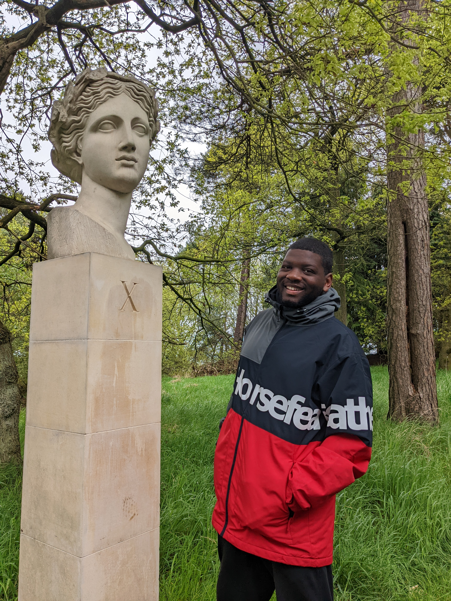

## About Me

Welcome. I’m Kai — a PhD student in the [Operations, Information and Decisions Department](https://oid.wharton.upenn.edu) at the [Wharton School of the University of Pennsylvania](https://www.wharton.upenn.edu/), and an affiliate of the [Centre for Causal Inference](https://dbei.med.upenn.edu/center-of-excellence/cci/) at Penn Biostat. I am very fortunate to be advised by [Dean Knox](https://dcknox.github.io).

I grew up in Birmingham, UK (but support Arsenal FC). Before joining Penn, I obtained a master’s degree in mathematics from [Imperial College London](https://www.imperial.ac.uk/mathematics/), during which I was grateful to spend a year studying abroad at the [École polytechnique fédérale de Lausanne](https://www.epfl.ch/en/) in [Switzerland](https://www.reddit.com/r/SwitzerlandIsFake/). 

When not in the office, you'll find me: at the cinema, playing **foot**ball or badminton, or reading or watching some dystopian science-fiction. 

## Research Interest

I study **causal inference** in theory and application. My research broadly follows two streams: (i) developing (algorithmic) partial identification strategies which permit causal inferences in challenging data environments; (ii) applying modern causal inference techniques to policy evaluation and investigate fairness in social and institutional settings, e.g. police enforcement and education. 

## News



---

> I don't read the [manu]script, the [manu]script reads me

- **Kirk Lazarus, Vietnam 2008**
